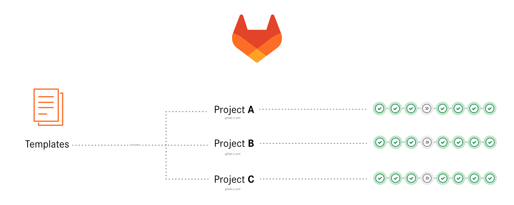

# XIMA GitLab-CI Templates



This repository provides several templates for reusable GitLab-CI jobs. 

## Installation

See [.gitlab-ci.yml.dist](.gitlab-ci.yml.dist) for example GitLab-CI configuration.

Use `include` to reference template files:

```yaml
include:
  - project: 'symfony-cms/general/misc/gitlab-ci-templates'
    ref: 1.x
    file:
      - '/.base.yml'
      - '/analyse/analyse-composer.yml'
```

Extend and override configuration variables:

```yaml
variables:
  PATH_APP_DIR: "app/"
```

Extend and override further ci jobs.

See further default configuration in the [.base.yml](.base.yml).

## Description of all the jobs

### Analyse

| Job name                              | File                                                                                | Description                                                                                |
|---------------------------------------|-------------------------------------------------------------------------------------|--------------------------------------------------------------------------------------------|
| `analyse:composer:lint`               | [analyse-composer-lint.yml](./analyse/analyse-composer-lint.yml)                    | Use composer normalize to lint `composer.json` via `composer run composer:normalize:check` |
| `analyse:composer:security:scheduled` | [analyse-composer-security-scheduled.yml](./analyse/analyse-composer-security-scheduled.yml) | Run composer dependency check via `vendor/bin/dep security:check:composer`                 |
| `analyse:editorconfig`                | [analyse-editorconfig.yml](./analyse/analyse-editorconfig.yml)                      | Check editorconfig for project files via `composer run editorconfig:check`                 |
| `analyse:php:cs-fixer`                | [analyse-php-cs-fixer.yml](./analyse/analyse-php-cs-fixer.yml)                      | Run php cs fixer to fix regarding coding standards via `composer run php:cs-fixer:check`   |
| `analyse:php:lint`                    | [analyse-php-lint.yml](./analyse/analyse-php-lint.yml)                              | Run php lint via `composer run php:lint`                                                   |
| `analyse:php:rector`                  | [analyse-php-rector.yml](./analyse/analyse-php-rector.yml)                          | Run php rector via `composer run php:rector:check`                                         |
| `analyse:php:stan`                    | [analyse-php-stan.yml](./analyse/analyse-php-stan.yml)                              | Run php stan via `composer run php:stan:check`                                             |
| `analyse:xml:lint`                    | [analyse-xml-lint.yml](./analyse/analyse-xml-lint.yml)                              | Lint xml files via `composer run xml:lint`                                                 |
| `analyse:yaml:lint`                   | [analyse-yaml-lint.yml](./analyse/analyse-yaml-lint.yml)                            | Lint yaml files via `composer run yaml:lint`                                               |


### Build

| Job name     | File                                                     | Description                                    |
|--------------|----------------------------------------------------------|------------------------------------------------|
| `build:node` | [build-node.yml](./build/build-node.yml)                 | Load frontend dependencies and build frontend  |
| `build:node` | [build-node-symfony.yml](./build/build-node-symfony.yml) | Symfony specific node build job                |
| `build:node` | [build-node-typo3.yml](./build/build-node-typo3.yml)     | TYPO3 specific node build job                  |
| `build:php`  | [build-php.yml](./build/build-php.yml)                   | Load php dependencies via composer             |
| `build:php`  | [build-php-typo3.yml](./build/build-php-typo3.yml)       | TYPO3 specific php build job                   |

### Deploy

| Job name                         | File                                                                              | Description                                                                                                    |
|----------------------------------|-----------------------------------------------------------------------------------|----------------------------------------------------------------------------------------------------------------|
| `deploy:feature`                 | [deploy-feature.yml](./deploy/deploy-feature.yml)                                 | Deploy a feature branch instance to a staging system                                                           |
| `deploy:feature:rollback`        | [deploy-feature-rollback.yml](./deploy/deploy-feature-rollback.yml)               | Rollback a deployment release for a feature branch                                                             |
| `deploy:feature:stop`            | [deploy-feature-stop.yml](./deploy/deploy-feature-stop.yml)                       | Stop a feature branch instance and remove the application from the staging system (trigger the downstream job) |
| `deploy:feature:stop:downstream` | [deploy-feature-stop-downstream.yml](./deploy/deploy-feature-stop-downstream.yml) | Stop a feature branch instance and remove the application from the staging system                              |
| `deploy:prod`                    | [deploy-prod.yml](./deploy/deploy-prod.yml)                                       | Deploy to the production system                                                                                |

### Sync

| Job name                 | File                                                            | Description                                                         |
|--------------------------|-----------------------------------------------------------------|---------------------------------------------------------------------|
| `sync:feature`           | [sync-feature.yml](./sync/sync-feature.yml)                     | Sync the data for a feature branch instance                         |
| `sync:feature:scheduled` | [sync-feature-scheduled.yml](./sync/sync-feature-scheduled.yml) | Sync the data for a feature branch instance via a periodic schedule |

### Test

| Job name                   | File                                                                | Description                                            |
|----------------------------|---------------------------------------------------------------------|--------------------------------------------------------|
| `test:feature:codeception` | [test-feature-codeception.yml](./test/test-feature-codeception.yml) | Test the feature branch instance via codeception       |
| `test:feature:lighthouse`  | [test-feature-lighthouse.yml](./test/test-feature-lighthouse.yml)   | Test the feature branch instance via google lighthouse |
| `test:prod:lighthouse`     | [test-prod-lighthouse.yml](./test/test-prod-lighthouse.yml)         | The the production system via google lighthouse        |

## Adjustments

### Paths

If your composer file(s) are not located in project root directory, you can change it to your needs.
PATH_CI_DIR specifies path to composer.json with deployment dependencies. If you have a separate composer.json for project dependencies yau can adapt that path as well. 

```yaml
variables:
  # project paths - default both to root directory
  PATH_CI_DIR: "${CI_PROJECT_DIR}"
  PATH_APP_DIR: "${PATH_CI_DIR}"
```

### Jobs

You can override or extend the given template jobs by adjusting individual aspects, e.g. the needed artifacts from the `build:node` job:

```yaml
build:node:
  artifacts:
    paths:
      - ${PATH_APP_DIR}/packages/xima-sitepackage/Resources/Public
      - ${PATH_APP_DIR}/packages/xima-media/Resources/Public
```

### Versions

Additionally configure used versions within the variables (default values are stored in the [.base.yml](.base.yml)):
```yaml
variables:
  BUILD_COMPOSER_VERSION: "2.6"
  BUILD_NODE_VERSION: "18"
  PHP_VERSION: "8.2"
```

### Feature-stop downstream branch
You can override on which branch the downstream pipeline should be triggered. Default is "main".
This is useful if main branch does not contain the current pipeline setup and therefore can't handel the trigger.
```yaml
.feature-branches:
  variables:
    FEATURE_STOP_DOWNSTREAM_BRANCH: main-v12
```

## Development

The development workflow provides for all minor changes to be checked into the "1.x" branch so that all associated projects automatically receive the latest version from this branch.
If there are breaking changes, a new branch "2.x" is created so that the associated projects can be updated manually.